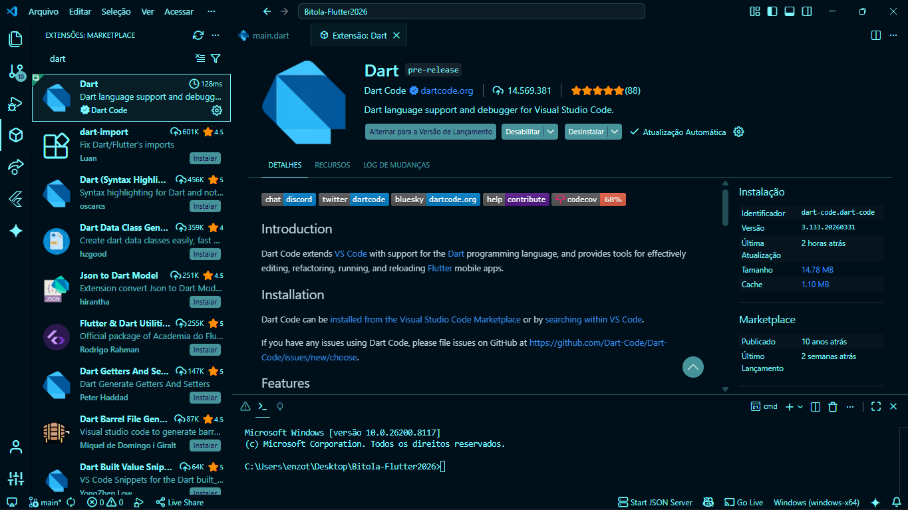
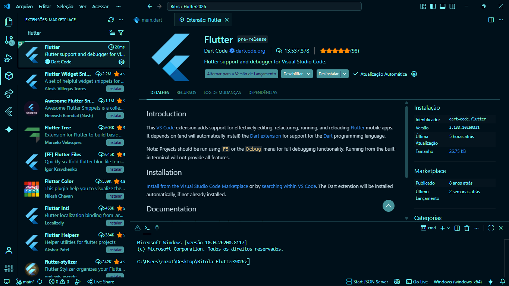
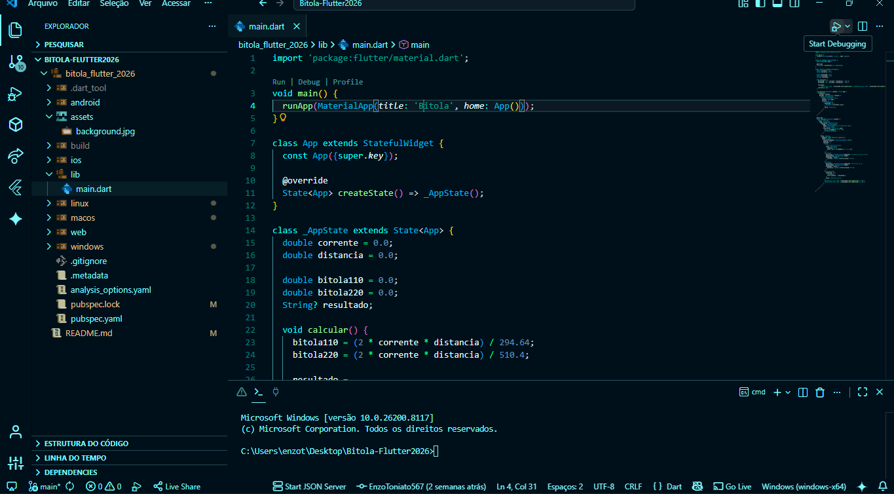

# Investiment Flutter: Apresentação do app

Aplicativo Flutter de simulação bitola e de fios elétricos, desenvolvido para auxiliar no dimensionamento da seção do condutor com base na corrente elétrica em ampères e na distância em metros, exibindo o resultado para redes de 110V e 220V.


# Objetivo
Auxiliar no cálculo da bitola adequada de fios elétricos de forma simples, ajudando estudantes a visualizar rapidamente o resultado para instalações em 110V e 220V com base nos dados informados pelo usuário.

## Protótipo Figma

[Acessar Protótipo no Figma](https://www.figma.com/proto/0IzN4RtEXVdIan7mI6e8EI/Bitola-Flutter?node-id=0-1&t=LD0E0aSgWoVSxbaW-1)

## Como executar o projeto (Passo a Passo)

- (Clone este repositório primeiro)

<p align="center">
  <em>1. Instalar a extensão Dart</em><br><br>
  <br>
  <em>2. Instalar a extensão Flutter</em><br><br>
  <br>
  <em>3. Abrir a pasta lib em main.dart</em><br><br>
  <br>
  <em>4. Clicar em start debugging</em>
</p>

## ⚙️ Funcionamento e Lógica

O aplicativo calcula a seção transversal (bitola) do condutor baseando-se na queda de tensão admissível para o circuito, utilizando a fórmula:

```dart
secao = (2 * corrente * distancia * 0.0172) / quedaDeTensao;
```

Onde:
- **valor**: Montante financiado.
- **i**: Taxa de juros mensal (decimal).
- **parcelas**: Quantidade de meses.

O valor total é a soma das parcelas multiplicada pela quantidade, somada às taxas extras informadas.

## 🛠️ Tecnologias e Requisitos

- **Flutter SDK**
- **Dart Extensão**
- **Flutter Extensão**
- **Git Hub**

### Comandos úteis via terminal:

Caso prefira rodar manualmente após configurar o ambiente:

1. Caso a imagem não apareça, rode:
   ```bash
   flutter pub get
   ```

2. Escolha um navegador e execute o app:
   ```bash
   flutter run
   ```
